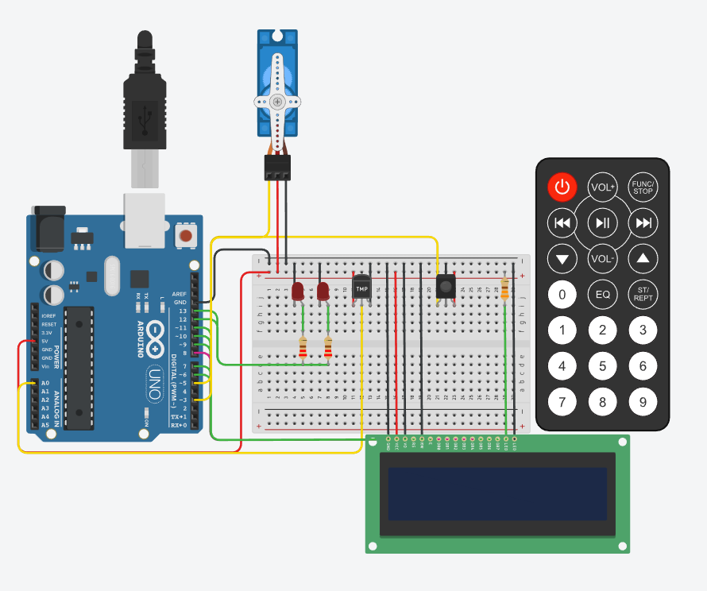
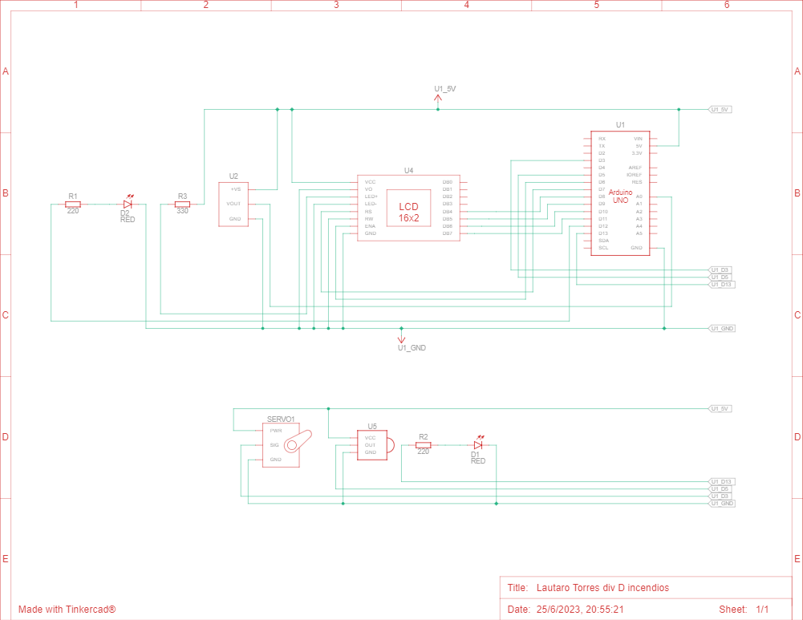

# Sistema_de_incendio

# Vista esquematica sistema de incendio

# Descripción
El objetivo de este proyecto es diseñar un sistema de incendio utilizando Arduino que pueda
detectar cambios de temperatura y activar un servo motor en caso de detectar un incendio.
Además, se mostrará la temperatura actual y la estación del año en un display LCD.

# Funcion principal
    void loop()
    {
    if (prendido_apagado)
    {
        int lectura_sensor = analogRead(sensor_temperatura);
        float temperatura_ambiente = (lectura_sensor * 5.0 / 1024.0 - 0.5) * 100.0;
            
        lcd.setCursor(0, 0);
        lcd.print("Temperatura: ");
        lcd.print(temperatura_ambiente);
        delay(500);
        detectar_estacion(temperatura_ambiente);
            if (temperatura_ambiente > 60)
            {
            mover_servo();
            parpadearRapido(13,12);
            }
            else
            {
                frenar_servo();
            }
            if (IrReceiver.decode()) 
            {
                Serial.println(IrReceiver.decodedIRData.decodedRawData, HEX);
                IrReceiver.resume();
                switch (IrReceiver.decodedIRData.decodedRawData)
                {
                    case 4278238976:
                    prendido_apagado = false;
                    lcd.setCursor(0, 0);
                    lcd.print("                ");
                    lcd.setCursor(0, 1);
                    lcd.print("                ");
                    break;
                }
                delay(50);
                irrecv.resume();
            }
    }
    else
    {
        if (IrReceiver.decode()) 
        {
            Serial.println(IrReceiver.decodedIRData.decodedRawData, HEX);
            IrReceiver.resume();
            switch (IrReceiver.decodedIRData.decodedRawData)
            {
                case 4278238976:
                prendido_apagado = true;
            }
            delay(50);
            irrecv.resume();
        }
    }
    }

# Explicacion funcion principal:
El loop verifica si el sistema está encendido. Si lo está, lee la temperatura, la muestra en la pantalla LCD y realiza acciones dependiendo de la temperatura. Si recibe una señal infrarroja específica, apaga el sistema. Si el sistema está apagado, verifica si recibe una señal infrarroja específica para encenderlo.

# Link al proyecto:
https://www.tinkercad.com/things/5FU6Wk5V8TM-lautaro-torres-div-d-incendios/editel?sharecode=d7WoC2s_YjoVxs3xcA7vKZfARa7jdLHXrk6JGb5TrKg